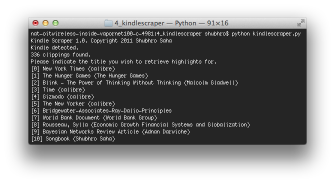

__Update 2015-12-23: Check out [Dickens](https://github.com/shbhrsaha/dickens) for a better experience.__

Kindle Scraper
==============

Quick & dirty Python script to upload highlighted notes from Amazon Kindle 3 to a computer.

Just run 'python kindlescraper.py' from Terminal.

For more information, see http://www.princeton.edu/~saha/kindlescraper/
